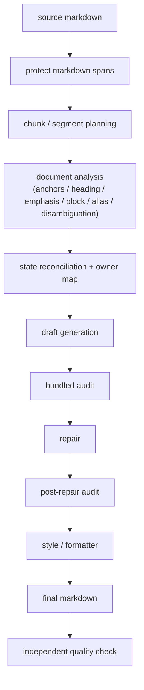

# Markdown 翻译 Pipeline 深度说明

这份文档不是规范，而是解释。目标是让没有参与这 50 多轮迭代的人，也能回答下面 4 个问题：

1. 当前 pipeline 实际怎么跑
2. 每个 LLM 交互点在做什么，输入输出是什么
3. 状态树里每个节点为什么存在，谁写谁读
4. 为什么一个看起来只是“把英文 Markdown 翻成中文”的任务，会在工程上变成一个长周期问题

主规范仍然是 [translation-system-design.md](./translation-system-design.md)。这份文档的角色是把“规范背后的执行现实”讲透。

## 0. 文中的真实例子来自哪里

除非特别说明，本文所有例子都来自仓库内 smoke fixture，而不是临时编的演示文本：

- 短文 fixture：[claude-code-sandbox-short.md](../test/fixtures/smoke/claude-code-sandbox-short.md)
- 长文 fixture：[claude-code-sandbox-full.md](../test/fixtures/smoke/claude-code-sandbox-full.md)

后文会反复引用这些真实片段：

- [标题 + 图注 + 强调导语](../test/fixtures/smoke/claude-code-sandbox-short.md#L1)
- [权限提示引用，含 `--dangerously-skip-permissions`](../test/fixtures/smoke/claude-code-sandbox-short.md#L9)
- [**Filesystem Isolation**](../test/fixtures/smoke/claude-code-sandbox-short.md#L71)
- [`npm registry` 列表项](../test/fixtures/smoke/claude-code-sandbox-short.md#L79)
- [The Sandbox alias 首现](../test/fixtures/smoke/claude-code-sandbox-short.md#L95)
- [混合 inline 的 `bubblewrap / macOS / Seatbelt` 段](../test/fixtures/smoke/claude-code-sandbox-short.md#L127)
- [### Prompt Injection Attacks](../test/fixtures/smoke/claude-code-sandbox-short.md#L135)
- [Testing Your Claude Code Sandbox Setup](../test/fixtures/smoke/claude-code-sandbox-short.md#L152)
- [`\"sandbox mode is active\"` 与 `Contents: sandbox mode is active`](../test/fixtures/smoke/claude-code-sandbox-short.md#L162)
- [Alternative Solutions (Windows)](../test/fixtures/smoke/claude-code-sandbox-short.md#L179)

## 1. 为什么这个任务没有看起来那么简单

表面上，这个任务像是“把英文翻成中文”。实际上，系统必须同时满足这些约束：

- Markdown 结构不坏：标题、列表、引用、代码块、链接、强调都必须还可读
- 首现锚定正确：术语、产品名、专名第一次出现时，形式必须对
- 段落和块顺序不乱：不能把后文标题提前，不能把两个块合成一个
- protected span 不丢：路径、flag、inline code、link destination 必须原样保留
- style 不能推翻语义真相：润色不能把已经建立的 canonical display 改坏

系统最初的错误假设，是把这个问题想成“一次 freeform 翻译，然后再做一点审校”。实际运行证明，这条主通道会持续暴露 3 类系统性问题：

- 模型自由生成整段 Markdown，容易把内容面和控制面混在一起
- 结构问题一旦漏过 draft，会在 audit/repair/re-audit 里被多次放大
- 不同 plan 没有先收敛成 owner，就会互相覆盖

所以现在的系统不是“让模型尽量聪明”，而是：

- 让 LLM 做语义决策
- 让状态工程做 owner / precedence / replay / structure
- 让 formatter 只做样式收尾

## 2. 总流程图



这张图里有 3 类节点：

- **LLM decision nodes**
  - `document analysis`
  - `draft generation`
  - `bundled audit / per-segment audit`
  - `repair`
  - `style`

- **state-engineering execution nodes**
  - `protect markdown spans`
  - `chunk / segment planning`
  - `state reconciliation + owner map`
  - 所有 normalize / restore / inject / applyXxxPlanTargets 逻辑

- **validation / formatting nodes**
  - `independent quality check`
  - `formatter`
  - `protected span integrity`

这套 pipeline 的关键思想是：

- LLM 不再直接拥有“最终文本真相”
- LLM 先产出 plan 或中间结果
- 程序再按状态树和 owner map 决定哪些文本可以落盘

## 3. Pipeline 逐步拆解

以下每一步都按同一模板说明：

- 目的
- 输入
- 输出
- 与 LLM 的交互
- 主要解决的失败模式

### 3.1 `protectMarkdownSpans`
代码入口：
- [markdown-protection.ts](../src/markdown-protection.ts)
- [protectMarkdownSpans](../src/markdown-protection.ts)
- [protectSegmentFormattingSpans](../src/markdown-protection.ts)

目的：
- 先把不该翻译的结构冻结成 placeholder，避免模型接触后乱改

输入：
- 原始 Markdown body

输出：
- `protectedBody`
- `ProtectedSpan[]`

与 LLM 的交互：
- 无。纯程序执行

主要解决的失败模式：
- code block 被翻成中文
- link destination 被改掉
- inline code / flag 被删掉
- raw HTML 被污染

说明：
- 这层不解决语义
- 这层只负责“不能坏的结构先锁死”

### 3.2 `planMarkdownChunks + splitProtectedChunkSegments`
代码入口：
- [translate.ts](../src/translate.ts)
- [planMarkdownChunks](../src/markdown-chunks.ts)
- [splitProtectedChunkSegments](../src/translate.ts)

目的：
- 把整篇文档切成可执行窗口
- 让 analysis/draft/audit 不必一次吞整篇

输入：
- 已保护的 Markdown

输出：
- `MarkdownChunkPlan`
- `ProtectedChunkSegment[]`

与 LLM 的交互：
- 无。纯程序切分

主要解决的失败模式：
- 全文调用过大，analysis 卡死
- instruction-heavy 段落过胖，draft 超时
- 标题、图注、引导句被错误打包进同一个 segment

当前实现重点：
- 先按 `##` 小节切 chunk
- 再按结构复杂度切 segment
- 最近几轮加入了：
  - intro 边界切分
  - segment complexity budget
  - micro-segment lane 前置识别

### 3.3 `analyzeDocumentForAnchors`
代码入口：
- [translate.ts](../src/translate.ts)
- [analyzeDocumentForAnchors](../src/translate.ts)

目的：
- 在真正翻译前，先做全文语义规划

输入：
- chunk/segment 树
- `known_entities`
- 当前 analysis shard

输出：
- `AnchorCatalog`
  - `anchors`
  - `headingPlans`
  - `emphasisPlans`
  - `blockPlans`
  - `aliasPlans`
  - `entityDisambiguationPlans`
  - `ignoredTerms`

与 LLM 的交互：
- 使用 [DOCUMENT_ANALYSIS_PROMPT](../src/internal/prompts/scheme-h.ts)
- 当前是 shard 化执行，不再一次性吃整篇
- 失败后会走：
  - shard retry
  - fallback split
  - heading-only recovery
  - emphasis-only recovery
  - quality gate

主要解决的失败模式：
- 术语首现靠 draft 临时发挥
- 标题策略不稳定
- alias first mention 没被识别
- emphasis target 只能靠后修复

现实中的问题：
- analysis 不是天然便宜
- 如果它只是“多做一遍理解”，而后续还继续自由发挥，就只是在加成本
- 它必须逐步替代后续理解工作，才真的值

### 3.4 `buildSegmentTaskSlice + reconcileSegmentSemanticPlans`
代码入口：
- [translation-state.ts](../src/translation-state.ts)
- [buildSegmentTaskSlice](../src/translation-state.ts)
- [reconcileSegmentSemanticPlans](../src/translation-state.ts)

目的：
- 把 analysis 产物压缩成当前 segment 可执行的局部真相

输入：
- `TranslationRunState`
- 当前 `chunkId / segmentId`

输出：
- `PromptSlice`

`PromptSlice` 里的关键字段：
- `requiredAnchors`
- `repeatAnchors`
- `establishedAnchors`
- `headingPlans`
- `emphasisPlans`
- `blockPlans`
- `aliasPlans`
- `entityDisambiguationPlans`
- `pendingRepairs`
- `analysisPlans`
- `analysisPlanDraft`

与 LLM 的交互：
- 不直接调用 LLM
- 但决定后续 prompt 里给 LLM 看什么

主要解决的失败模式：
- 同一标题同时受 `headingPlan` 和 global anchor 管辖
- 同一文本 span 被两个 plan 混写
- repeat anchor 被错误重复补锚
- local structured target 和 global canonical 打架

这里的核心不是“收集字段”，而是：

- **收敛**
- **裁决**
- **局部化**

### 3.5 `translateProtectedSegment`
代码入口：
- [translate.ts](../src/translate.ts)
- [translateProtectedSegment](../src/translate.ts)

目的：
- 生成当前 segment 的第一版译文

输入：
- `ProtectedChunkSegment`
- `PromptSlice`
- 当前 chunk/segment context

输出：
- `DraftedSegmentState`

与 LLM 的交互：
- 这一步是当前系统最复杂、也最脆弱的地方

当前有多条 draft lane：
- `literal lane`
- `sentence prompt lane`
- `block-structured prompt lane`
- `JSON blocks draft lane`
- `freeform draft lane`

主要解决的失败模式：
- meta/audit 文本泄漏到正文
- 后文段落提前写进当前段
- heading / code block 凭空出现
- micro-segment 过拟合上下文

### 3.6 `runBundledGateAudit`
代码入口：
- [translate.ts](../src/translate.ts)
- [runBundledGateAudit](../src/translate.ts)

目的：
- 先一次性看完当前 chunk 的全部 segment
- 判断是否存在统一结构问题

输入：
- 当前 chunk 的 drafted segments

输出：
- `BundledGateAudit`

与 LLM 的交互：
- 用 [BUNDLED_GATE_AUDIT_PROMPT](../src/internal/prompts/scheme-h.ts)
- 返回每个 segment 的 `hard_checks + must_fix + repair_targets`

主要解决的失败模式：
- 段落数不对
- 首现双语不对
- 结构保护不完整
- 某些 chunk 级整体错位

现实问题：
- bundled audit 有时会超时
- 所以系统会 fallback 到 per-segment audit

### 3.7 `repairDraftedSegment`
代码入口：
- [translate.ts](../src/translate.ts)
- [repairDraftedSegment](../src/translate.ts)

目的：
- 对已经被 hard gate 指出的具体问题做修补

输入：
- 当前 segment 的 drafted body
- `RepairTask[]`

输出：
- 更新后的 `currentProtectedBody / currentRestoredBody`

与 LLM 的交互：
- 使用 [REPAIR_PROMPT](../src/internal/prompts/scheme-h.ts)
- 当前最新架构里，repair 不再只靠 freeform
- 高风险场景已经逐步切到：
  - `JSON block repair lane`

主要解决的失败模式：
- 错误的首现锚定
- 句子级约束没有落到正文
- 标题没恢复
- block 级内容被污染

### 3.8 `runPostRepairGateAudit`
代码入口：
- [translate.ts](../src/translate.ts)
- [runPostRepairGateAudit](../src/translate.ts)

目的：
- repair 之后再审一次
- 确认这次修没带来新坏

输入：
- repaired segments
- repaired segment index set

输出：
- 新一轮 gate audit 结果

与 LLM 的交互：
- 优先按 per-segment 审校
- 只复审受影响 segment

主要解决的失败模式：
- repair 修了一点，又引入别的问题
- 双括注
- 锚点被改丢
- 结构重新破坏

### 3.9 `applyFinalStylePolish`
代码入口：
- [translate.ts](../src/translate.ts)
- [applyFinalStylePolish](../src/translate.ts)

目的：
- 在 hard gate 全通过后，做纯可读性润色

输入：
- 英文原文
- 当前完整译文

输出：
- style 后正文

与 LLM 的交互：
- 使用 [STYLE_POLISH_PROMPT](../src/internal/prompts/scheme-h.ts)

主要解决的失败模式：
- 翻译腔
- 节奏不自然

但要特别强调：
- style 不能救火
- style 不能推翻 canonical
- style 不能改结构真相

### 3.10 `writeDebugStateIfRequested`
代码入口：
- [translate.ts](../src/translate.ts)
- [writeDebugStateIfRequested](../src/translate.ts)

目的：
- 在 smoke/调试时把 `state.json / ir.md` 落盘

输入：
- 当前 `TranslationRunState`

输出：
- 调试文件

与 LLM 的交互：
- 无

主要解决的失败模式：
- 失败后只能看 stderr，不知道 state 当时长什么样

## 4. Prompt 手册

下面是当前系统的 prompt 节点总表。

| 节点 | 文件 | 触发时机 | 输出形状 | 主要解决的问题 |
| --- | --- | --- | --- | --- |
| `DOCUMENT_ANALYSIS_PROMPT` | [scheme-h.ts](../src/internal/prompts/scheme-h.ts) | 全文/分片分析 | JSON catalog | 术语、标题、强调、块顺序、alias、disambiguation |
| `buildHeadingRecoveryAnalysisPrompt` | [scheme-h.ts](../src/internal/prompts/scheme-h.ts) | heading 计划缺失 | JSON headingPlans | 标题计划覆盖率不足 |
| `buildEmphasisRecoveryAnalysisPrompt` | [scheme-h.ts](../src/internal/prompts/scheme-h.ts) | emphasis 计划缺失 | JSON emphasisPlans | 强调结构在 draft 前就缺 plan |
| `INITIAL_TRANSLATION_PROMPT` | [scheme-h.ts](../src/internal/prompts/scheme-h.ts) | 默认 draft | freeform Markdown | 正常段落翻译 |
| `buildContractSafeDraftPrompt` | [translate.ts](../src/translate.ts) | draft contract 违规后 | freeform Markdown | 结构越界时的 source-only 救援 |
| `buildSentenceDraftPrompt` | [translate.ts](../src/translate.ts) | 单句/单段 micro segment | freeform Markdown | 让单段句子不要过拟合整个上下文 |
| `buildBlockStructuredDraftPrompt` | [translate.ts](../src/translate.ts) | 小型多块段救援 | freeform Markdown | 强调“按块翻”，但仍是文本输出 |
| `buildJsonBlockDraftPrompt` | [translate.ts](../src/translate.ts) | 多块高风险段 | JSON `blocks[]` | 把 draft 从 freeform 转成按块输出 |
| `GATE_AUDIT_PROMPT` | [scheme-h.ts](../src/internal/prompts/scheme-h.ts) | per-segment audit | JSON hard checks | 单段硬性审校 |
| `BUNDLED_GATE_AUDIT_PROMPT` | [scheme-h.ts](../src/internal/prompts/scheme-h.ts) | chunk audit | JSON per segment | 先整体审一遍整个 chunk |
| `REPAIR_PROMPT` | [scheme-h.ts](../src/internal/prompts/scheme-h.ts) | 普通 repair | freeform Markdown | 常规局部修补 |
| `buildJsonBlockRepairPrompt` | [translate.ts](../src/translate.ts) | 多块 repair | JSON `blocks[]` | 避免 repair 再自由重写整段 |
| `STYLE_POLISH_PROMPT` | [scheme-h.ts](../src/internal/prompts/scheme-h.ts) | hard pass 之后 | freeform Markdown | 只做可读性润色 |

### 4.1 Analysis prompt
节点：
- [DOCUMENT_ANALYSIS_PROMPT](../src/internal/prompts/scheme-h.ts)

解决的问题：
- 全文里到底哪些词需要双语
- 哪些标题是自然中文，哪些必须双语
- 哪些强调要保留
- 哪些 block 顺序未来要锁死

真实来源：
- 标题例子：[**Filesystem Isolation**](../test/fixtures/smoke/claude-code-sandbox-short.md#L71)
- alias 例子：[The Sandbox works by differentiating between these two cases.](../test/fixtures/smoke/claude-code-sandbox-short.md#L95)
- 强调例子：[Claude Code **now has a sandbox mode** that makes the YOLO mode look amateurish.](../test/fixtures/smoke/claude-code-sandbox-short.md#L7)

输入示例：

```json
{
  "analysisScope": {
    "mode": "shard",
    "chunkIds": ["chunk-2"],
    "sourceChars": 1717,
    "headingCount": 6
  },
  "chunks": [
    {
      "segments": [
        {
          "headingLikeLines": [
            { "index": 1, "sourceHeading": "Filesystem Isolation" }
          ],
          "emphasisLikeSpans": [],
          "source": "**Filesystem Isolation**\n\n- Safe zone where Claude can work freely..."
        }
      ]
    }
  ]
}
```

期望输出示例：

```json
{
  "anchors": [
    {
      "english": "Filesystem Isolation",
      "chineseHint": "文件系统隔离",
      "familyKey": "filesystem isolation",
      "displayPolicy": "chinese-primary",
      "firstOccurrence": {
        "chunkId": "chunk-2",
        "segmentId": "chunk-2-segment-4"
      }
    }
  ],
  "headingPlans": [
    {
      "chunkId": "chunk-2",
      "segmentId": "chunk-2-segment-4",
      "headingIndex": 2,
      "sourceHeading": "Filesystem Isolation",
      "strategy": "concept",
      "targetHeading": "文件系统隔离（Filesystem Isolation）",
      "english": "Filesystem Isolation",
      "chineseHint": "文件系统隔离"
    }
  ]
}
```

失败模式：
- 只给 `anchor` 不给 `headingPlan`
- 给了 `headingPlan`，但 `targetHeading` 还是纯中文
- 给了 blockPlan，但没有 targetText

### 4.2 Heading recovery prompt
节点：
- [buildHeadingRecoveryAnalysisPrompt](../src/internal/prompts/scheme-h.ts)

解决的问题：
- analysis 结束后，heading plan coverage 不够

真实来源：
- [**Filesystem Isolation**](../test/fixtures/smoke/claude-code-sandbox-short.md#L71)
- [### Prompt Injection Attacks](../test/fixtures/smoke/claude-code-sandbox-short.md#L135)

输入示例：

```json
{
  "analysisScope": {
    "mode": "heading-recovery",
    "headingCount": 6
  },
  "headings": [
    {
      "chunkId": "chunk-2",
      "segmentId": "chunk-2-segment-4",
      "headingIndex": 2,
      "sourceHeading": "Filesystem Isolation"
    }
  ]
}
```

期望输出示例：

```json
{
  "headingPlans": [
    {
      "chunkId": "chunk-2",
      "segmentId": "chunk-2-segment-4",
      "headingIndex": 2,
      "sourceHeading": "Filesystem Isolation",
      "strategy": "concept",
      "targetHeading": "文件系统隔离（Filesystem Isolation）",
      "english": "Filesystem Isolation",
      "chineseHint": "文件系统隔离"
    }
  ]
}
```

### 4.3 Emphasis recovery prompt
节点：
- [buildEmphasisRecoveryAnalysisPrompt](../src/internal/prompts/scheme-h.ts)

解决的问题：
- 强调本该保留，但 analysis 没产出 emphasisPlan

真实来源：
- [Claude Code **now has a sandbox mode** that makes the YOLO mode look amateurish.](../test/fixtures/smoke/claude-code-sandbox-short.md#L7)

输入示例：

```json
{
  "analysisScope": {
    "mode": "emphasis-recovery",
    "emphasisCount": 1
  },
  "emphasisSpans": [
    {
      "chunkId": "chunk-1",
      "segmentId": "chunk-1-segment-4",
      "sourceText": "now has a sandbox mode"
    }
  ]
}
```

期望输出示例：

```json
{
  "emphasisPlans": [
    {
      "chunkId": "chunk-1",
      "segmentId": "chunk-1-segment-4",
      "emphasisIndex": 1,
      "lineIndex": 1,
      "sourceText": "now has a sandbox mode",
      "strategy": "preserve-strong",
      "targetText": "现在有了沙盒模式（sandbox mode）",
      "governedTerms": ["sandbox mode"]
    }
  ]
}
```

### 4.4 Initial draft prompt
节点：
- [INITIAL_TRANSLATION_PROMPT](../src/internal/prompts/scheme-h.ts)

解决的问题：
- 对普通、稳定段落直接给出第一版中文译文

真实来源：
- [Claude Code’s new sandbox mode solves both problems with a more innovative approach.](../test/fixtures/smoke/claude-code-sandbox-short.md#L21)
- [Sandbox mode addresses real attack vectors that affect autonomous coding agents:](../test/fixtures/smoke/claude-code-sandbox-short.md#L133)

失败模式：
- meta/audit 文本混入
- 引入后文 block
- 合并/拆分段落

### 4.5 Contract-safe draft prompt
节点：
- [buildContractSafeDraftPrompt](../src/translate.ts)

解决的问题：
- freeform draft 一旦越界，用更窄 prompt 把它拉回“只翻当前 segment”

真实来源：
- [Claude Code **now has a sandbox mode** that makes the YOLO mode look amateurish.](../test/fixtures/smoke/claude-code-sandbox-short.md#L7)
- [If you’ve been coding with Claude Code... --dangerously-skip-permissions ...](../test/fixtures/smoke/claude-code-sandbox-short.md#L9)

输入示例：

```md
【英文原文】
Claude Code **now has a sandbox mode** that makes the YOLO mode look amateurish.
```

关键约束：
- 不得引入不在 source 中的标题、代码块、列表、引用或后文内容

### 4.6 Sentence prompt
节点：
- [buildSentenceDraftPrompt](../src/translate.ts)

解决的问题：
- 单句 / 单段 micro segment 不适合 rich-context freeform

真实来源：
- [Claude Code’s new sandbox mode solves both problems with a more innovative approach.](../test/fixtures/smoke/claude-code-sandbox-short.md#L21)
- [Sandbox mode addresses real attack vectors that affect autonomous coding agents:](../test/fixtures/smoke/claude-code-sandbox-short.md#L133)

适用：
- 单段 paragraph
- 短句

### 4.7 Block-structured text prompt
节点：
- [buildBlockStructuredDraftPrompt](../src/translate.ts)

解决的问题：
- 小型多块段需要按块翻，但还没完全切到 JSON blocks

真实来源：
- [The Sandbox works by differentiating between these two cases.](../test/fixtures/smoke/claude-code-sandbox-short.md#L95)
- [## How Sandbox Mode Changes Autonomous Coding](../test/fixtures/smoke/claude-code-sandbox-short.md#L97)

适用：
- 过渡态
- 当前未来应继续缩减使用范围

### 4.8 JSON block draft prompt
节点：
- [buildJsonBlockDraftPrompt](../src/translate.ts)

解决的问题：
- 对高风险段型，要求模型按 block 数输出固定 `blocks[]`
- 程序再重组 Markdown

真实来源：
- [开篇标题 + 图注 + 强调导语](../test/fixtures/smoke/claude-code-sandbox-short.md#L1)
- [Testing Your Claude Code Sandbox Setup](../test/fixtures/smoke/claude-code-sandbox-short.md#L152)

输入示例：

```text
### BLOCK 1 (blockquote)
> If you’ve been coding with Claude Code...

### BLOCK 2 (paragraph)
Neither option is sustainable.
```

输出示例：

```json
{
  "blocks": [
    "> 如果你一直在用 Claude Code 编程……",
    "这两种选择都不可持续。"
  ]
}
```

### 4.9 Gate audit prompt
节点：
- [GATE_AUDIT_PROMPT](../src/internal/prompts/scheme-h.ts)

解决的问题：
- 对单个 segment 做硬性审校

真实来源：
- [**Filesystem Isolation**](../test/fixtures/smoke/claude-code-sandbox-short.md#L71)
- [`--dangerously-skip-permissions`](../test/fixtures/smoke/claude-code-sandbox-short.md#L52)
- [### Prompt Injection Attacks](../test/fixtures/smoke/claude-code-sandbox-short.md#L135)

输出结构：
- `hard_checks`
- `must_fix`
- `repair_targets`

### 4.10 Bundled gate audit prompt
节点：
- [BUNDLED_GATE_AUDIT_PROMPT](../src/internal/prompts/scheme-h.ts)

解决的问题：
- 先整体检查 chunk
- 遇到 timeout 或 incomplete results 时 fallback 到 per-segment audit

真实来源：
- [chunk 1: 标题 / 图注 / 强调导语 / 引用](../test/fixtures/smoke/claude-code-sandbox-short.md#L1)
- [chunk 4: Prompt Injection Attacks + 测试段](../test/fixtures/smoke/claude-code-sandbox-short.md#L135)

### 4.11 Repair prompt
节点：
- [REPAIR_PROMPT](../src/internal/prompts/scheme-h.ts)

解决的问题：
- 对单段做局部补丁式修复

真实来源：
- [The Sandbox works by differentiating between these two cases.](../test/fixtures/smoke/claude-code-sandbox-short.md#L95)
- [`This is not Claude code by default... bubblewrap ... Seatbel*t`](../test/fixtures/smoke/claude-code-sandbox-short.md#L127)
- [`npm registry` 列表项](../test/fixtures/smoke/claude-code-sandbox-short.md#L79)

当前真实问题：
- 它本质还是 freeform 文本输出
- 所以最近几轮的主通道重构，正在把 repair 也逐步迁出 freeform

### 4.12 JSON block repair prompt
节点：
- [buildJsonBlockRepairPrompt](../src/translate.ts)

解决的问题：
- 多块 segment repair 不再自由重写整段
- 程序要求模型返回固定数量的 `blocks[]`

真实例子：

```md
原文片段：
> If you’ve been coding with Claude Code, you’ve likely hit two walls: the constant permission prompts that kill productivity, or the --dangerously-skip-permissions flag that removes all safety guardrails.
```

这里 repair 的目标不是“重新发挥一段更自然的中文”，而是：
- 保留 `--dangerously-skip-permissions` 这个受保护 span
- 只修当前 block
- 不得把修复扩写成审校说明或命令输出

所以 `buildJsonBlockRepairPrompt` 的存在，就是为了把这类高风险 block 的 repair 从 freeform 文本，收紧成固定 `blocks[]` patch。

### 4.13 Style prompt
节点：
- [STYLE_POLISH_PROMPT](../src/internal/prompts/scheme-h.ts)

解决的问题：
- 只做 style，不改硬性项

真实来源：
- [Alternative Solutions (Windows)](../test/fixtures/smoke/claude-code-sandbox-short.md#L179)
- [Testing Your Claude Code Sandbox Setup](../test/fixtures/smoke/claude-code-sandbox-short.md#L152)

## 5. 状态树手册

### 5.1 `DocumentState`
作用：
- 记录全局文档元信息

关键字段：
- `sourcePathHint`
- `title`
- `frontmatterPresent`
- `chunkCount`
- `protectedSpanCount`

谁写：
- [createTranslationRunState](../src/translation-state.ts)

谁读：
- analysis prompt
- debug export

### 5.2 `ChunkState`
作用：
- 记录 chunk 生命周期和失败摘要

真实例子：
- `chunk 1` 常覆盖短文开篇这组 block：
  - [标题 + 图注 + 强调导语 + 权限提示引用](../test/fixtures/smoke/claude-code-sandbox-short.md#L1)
- `chunk 4` 常覆盖攻击与测试段：
  - [### Prompt Injection Attacks](../test/fixtures/smoke/claude-code-sandbox-short.md#L135)

关键字段：
- `phase`
- `segmentIds`
- `finalBody`
- `lastFailure`

其中最关键的是 `ChunkState.lastFailure`：
- 它不是给人看的备注
- 它是 chunk 级失败回放的结构化入口
- 如果这里只落摘要、不回流为 executable repair，后续就会重新退回自然语言 `must_fix`

谁写：
- [translateProtectedChunk](../src/translate.ts)
- [markChunkFailure](../src/translation-state.ts)

谁读：
- smoke/debug
- chunk failure reify

最容易断链的点：
- `lastFailure` 只停在 chunk 摘要，没有回流成 executable repair

### 5.3 `SegmentState`
作用：
- 当前系统最重要的状态节点
- 记录当前 segment 的 source、current body、IR plans、repair 任务和 phase

真实例子：
- 一个典型 `SegmentState` 可以对应：
  - [The Sandbox works by differentiating between these two cases.](../test/fixtures/smoke/claude-code-sandbox-short.md#L95)
  - [This is not Claude code by default, but it’s isolation enforced by Linux bubblewrap or macOS Seatbel*t...](../test/fixtures/smoke/claude-code-sandbox-short.md#L127)
- 这两类段分别会触发：
  - alias / family owner
  - entity disambiguation
  - mixed inline / source-shape
  - repairTask 回放

关键字段：
- `source`
- `currentProtectedBody`
- `currentRestoredBody`
- `headingPlans`
- `emphasisPlans`
- `blockPlans`
- `aliasPlans`
- `entityDisambiguationPlans`
- `lastAudit`
- `repairTaskIds`
- `phase`
- `threadId`

其中必须单独理解的是 `SegmentState.lastAudit`：
- 它表示“当前 segment 最近一次 hard gate / post-repair audit 的结构化结果”
- 它不是最终真相，而是最近一次审校观察
- 如果 `SegmentState.lastAudit` 和 `ChunkState.lastFailure` 彼此脱节，就会出现“chunk 已失败，但 segment 仍像 pass 一样继续”的断链问题

谁写：
- draft
- audit
- repair
- applyAnchorCatalog

谁读：
- buildSegmentTaskSlice
- normalize / inject / restore
- subsequent audit / repair

### 5.4 `AnchorState`
作用：
- 全局或局部锚点真相

关键字段：
- `english`
- `chineseHint`
- `displayPolicy`
- `familyId`
- `firstOccurrence`
- `status`

### 5.5 `RepairTask`
作用：
- 程序真正执行 repair 的最小对象

关键字段：
- `instruction`
- `structuredTarget`
- `sentenceConstraint`
- `analysisPlanIds`
- `analysisTargets`
- `status`

### 5.6 `PromptSlice`
作用：
- 当前 segment 对应的局部执行视图

关键字段：
- `requiredAnchors`
- `repeatAnchors`
- `establishedAnchors`
- `headingPlans`
- `emphasisPlans`
- `blockPlans`
- `pendingRepairs`
- `analysisPlans`
- `analysisPlanDraft`

为什么 `state` 是单一真相：
- 因为后续所有 prompt、normalize 和 repair 都必须基于它
- 不能让 `must_fix` 自然语言成为程序真相

## 6. Owner / Reconciliation

这一章的核心问题只有一个：

**为什么同一段文本不能让多个 plan 同时直接执行？**

因为一旦这样做，就会出现：
- 标题是纯中文，但 anchor 要双语
- emphasis target 是纯中文，但 required anchor 要 canonical bilingual
- alias 和 canonical 混拼

当前 owner 级别：
1. `protected owner`
2. `heading / block / sentence owner`
3. `alias / entityDisambiguation owner`
4. `matched global canonical`
5. `local structured target`
6. `generic normalization`
7. `formatter`

案例：
- `Prompt Injection Attacks`
  - 真实来源：[claude-code-sandbox-short.md#L135](../test/fixtures/smoke/claude-code-sandbox-short.md#L135)
- `sandbox / sandbox mode`
  - 真实来源：[claude-code-sandbox-short.md#L95](../test/fixtures/smoke/claude-code-sandbox-short.md#L95)、[claude-code-sandbox-short.md#L162](../test/fixtures/smoke/claude-code-sandbox-short.md#L162)
- `npm registry`
  - 真实来源：[claude-code-sandbox-short.md#L79](../test/fixtures/smoke/claude-code-sandbox-short.md#L79)
- `Filesystem Isolation`
  - 真实来源：[claude-code-sandbox-short.md#L71](../test/fixtures/smoke/claude-code-sandbox-short.md#L71)

## 7. 为什么 50+ 轮还没压住

结论直接写：

### 7.1 执行层问题
- timeout
- thread/resume
- empty final message
- 这些曾经让系统看起来像“随机挂死”

### 7.2 freeform 主通道问题
- draft freeform
- repair freeform
- meta/audit text leakage
- control-plane text leakage
- over-expansion / block pollution

### 7.3 reconciliation 问题
- headingPlan 纯中文 vs required anchor 双语
- emphasis/block target 抹掉 canonical
- family/scope hybrid display

### 7.4 性能问题
- analysis shard 过大时，首刀就会变慢
- freeform 失败会放大后面的 audit/repair/re-audit 成本
- 拉长 timeout 从来不是根治

## 8. 当前策略图谱

| Lane | 适用段型 | 为什么存在 | 替代了什么 |
| --- | --- | --- | --- |
| `literal lane` | 单行 heading / attribution / numeric kicker | 这些对象不需要 LLM 自由发挥 | freeform draft |
| `sentence lane` | 单句 / 单段短 paragraph | 减少 micro-segment overfit | rich-context draft |
| `block-structured prompt lane` | 小型多块段 | 先强调“按块翻” | freeform draft |
| `JSON blocks draft lane` | 高风险多块段 | 固定 block 数输出 | freeform draft |
| `JSON blocks repair lane` | 多块 repair | 避免 repair 重写整段 | freeform repair |
| `freeform fallback lane` | 仍未迁出的普通段 | 兼容和速度 | 目前还没完全去掉 |

必须明确：

**当前系统仍未完全移除 freeform 通道。**  
这就是为什么问题还能持续暴露。

## 9. 验证链为什么贵

一次失败为什么会放大成很多次调用：

- analysis
- heading/emphasis recovery
- draft
- bundled audit
- per-segment audit
- repair
- re-audit

所以一个看起来像：
- “只是一句没补英文”

在系统里会变成：
- 多轮模型调用
- 多层状态回写
- 多次 contract 校验

## 10. 当前最小结论

当前已经明确的事实：

- analysis 已经不再是唯一主瓶颈
- state/owner/reconciliation 方向是对的
- 真正还没完全收口的是：
  - `freeform generation` 主通道
  - 尤其是 draft / repair 在高风险段型上的自由输出

下一阶段最合理的方向：

- 继续把更多段型迁到 `JSON blocks`
- 让 repair 进一步结构化
- 把 freeform 只留给低风险普通段

这不是“补 prompt”，而是**主通道重构**。
